<p align="center">
  <a href="./">
    
  </a>
</p>

<p align="left">
  GHDMusic is a Windows desktop music player that scans your local audio,
  enriches it with metadata and cover art, and brings playback, discovery,
  downloads, lyrics, playlists and library organization together in one responsive
  experience. It is built to keep your music easy to explore, personalize and
  enjoy, whether the files come from your collection or from a new download.
</p>

## Download

<p align="left">
  <a href="https://github.com/guillermodubon/ghdmusic-player/releases/download/v1.0.0/GHDMusic-Setup.exe">
        <strong>⬇️ Download GHDMusic for Windows</strong>
  </a>
</p>

<p align="left">
  Windows x64 installer · Latest stable release
</p>

## Screenshots

Here is a quick look at the main library, discovery, playlist, search and
full-screen playback experiences in GHDMusic.

<table>
  <tr>
    <td align="center">
      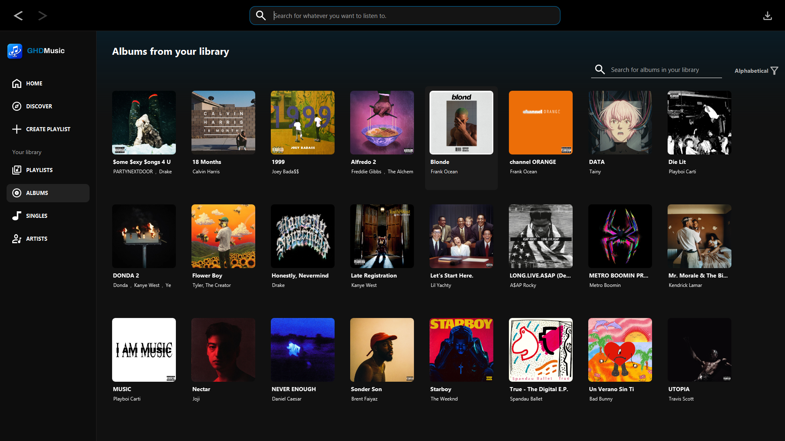
      <br><sub>Music library</sub>
    </td>
    <td align="center">
      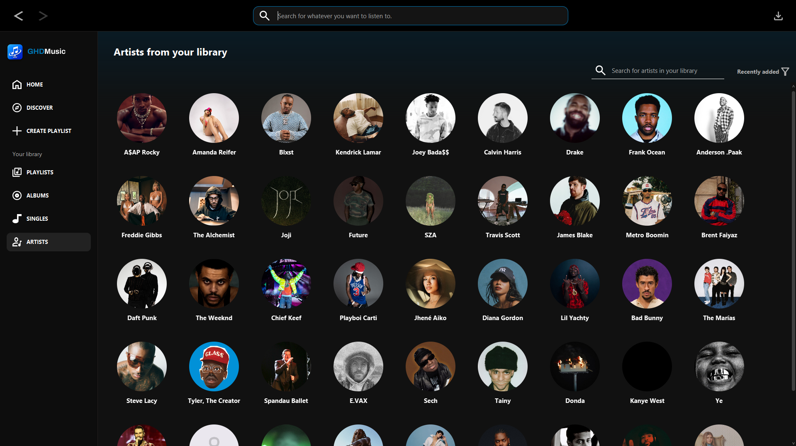
      <br><sub>Artists library</sub>
    </td>
  </tr>
  <tr>
    <td align="center">
      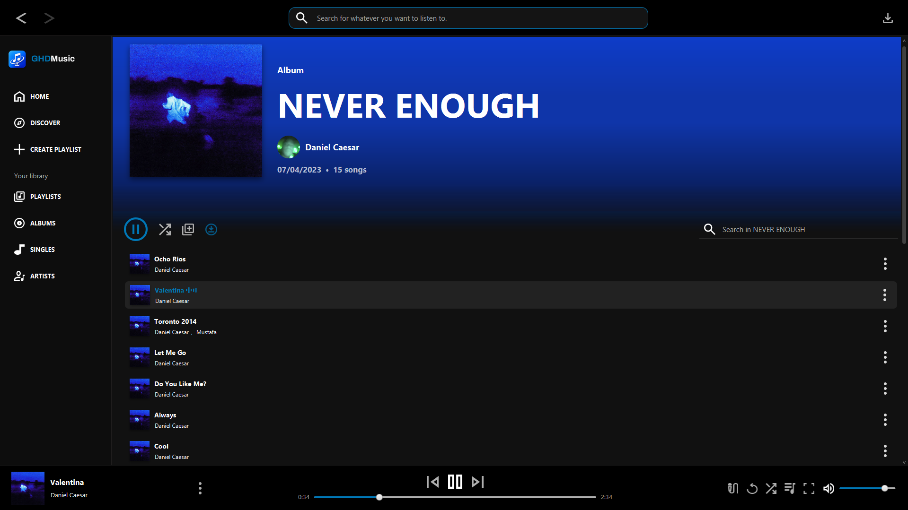
      <br><sub>Album view</sub>
    </td>
    <td align="center">
      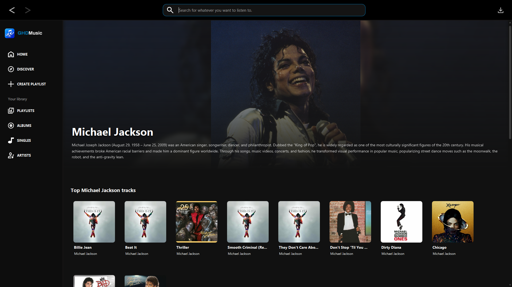
      <br><sub>Artist page</sub>
    </td>
  </tr>
  <tr>
    <td align="center">
      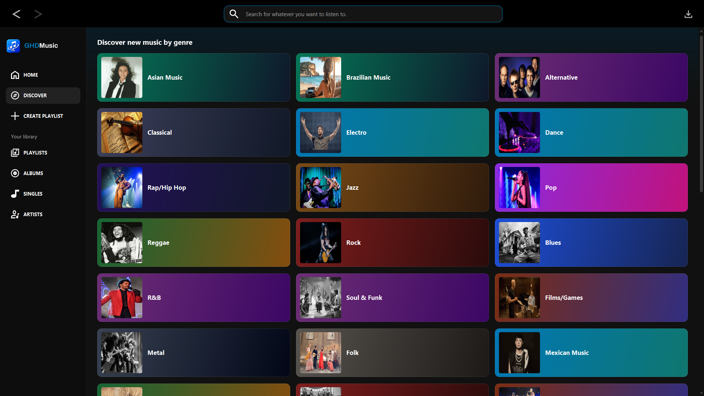
      <br><sub>Discover page</sub>
    </td>
    <td align="center">
      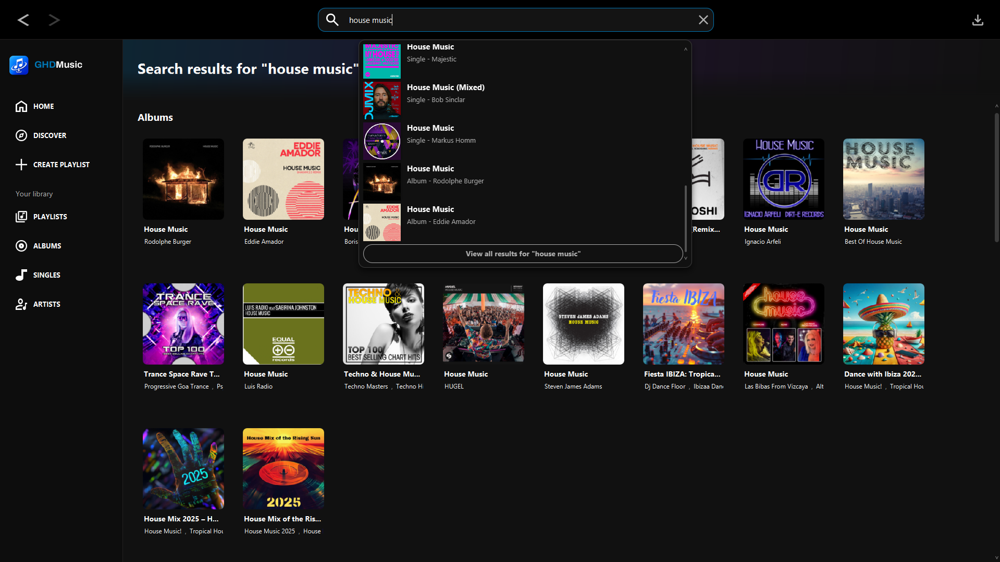
      <br><sub>Search and quick results</sub>
    </td>
  </tr>
  <tr>
    <td align="center">
      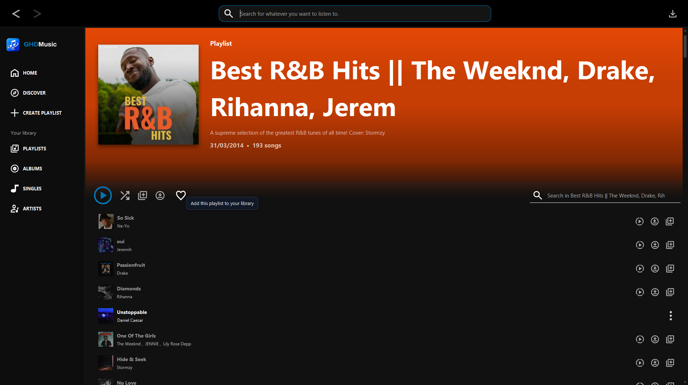
      <br><sub>Save a remote playlist</sub>
    </td>
    <td align="center">
      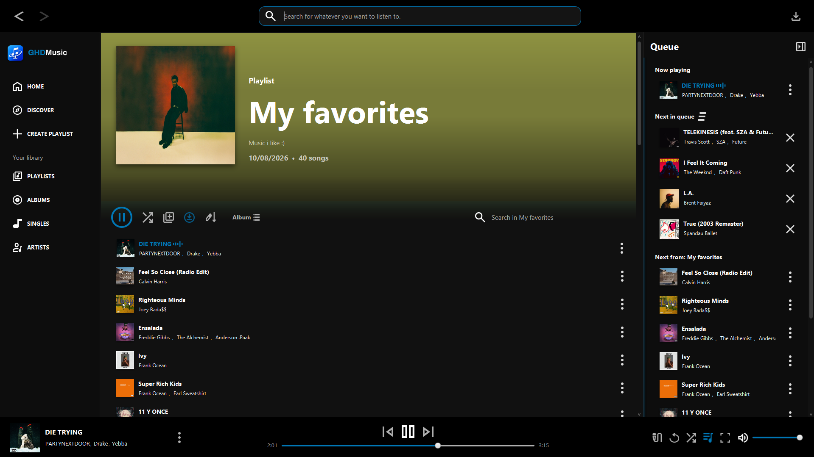
      <br><sub>Local playlist and queue</sub>
    </td>
  </tr>
  <tr>
    <td align="center">
      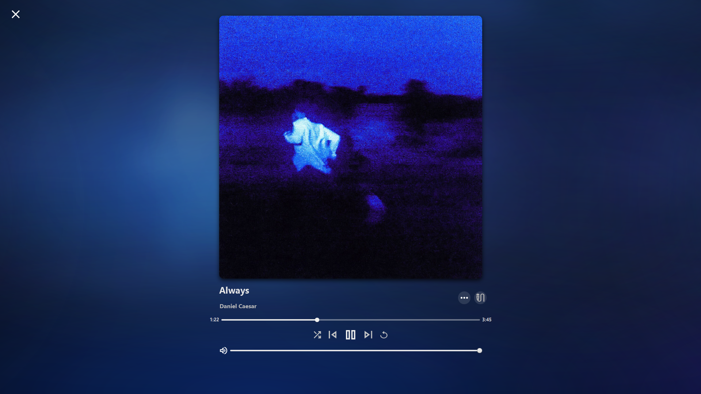
      <br><sub>Full-screen player</sub>
    </td>
    <td align="center">
      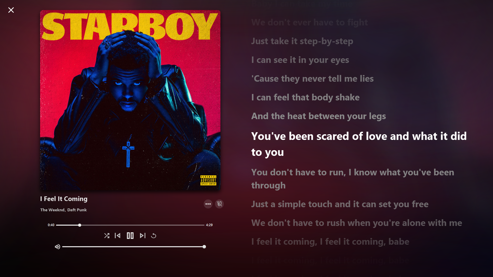
      <br><sub>Full-screen synchronized lyrics</sub>
    </td>
  </tr>
  <tr>
    <td align="center" colspan="2">
      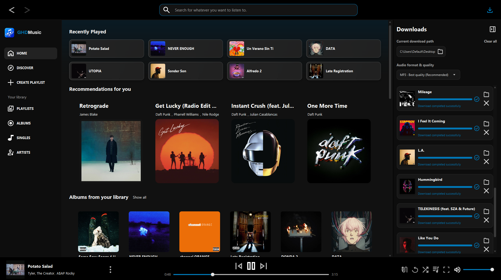
      <br><sub>Immersive playback mode</sub>
    </td>
  </tr>
</table>

## What GHDMusic does

- Scans the Windows **Downloads**, **Music** and **Desktop** folders for audio.
- Keeps every discovered file playable and enriches identified tracks with Deezer metadata: title, artist, album, genre, release details and cover art.
- Organizes local music into a searchable library of albums, singles, artists and playlists.
- Plays local files in a persistent player and streams remote previews when available, including mixed downloaded and remote lists.
- Supports normal and shuffle playback, plus `Next in queue` and `Next from` sections with drag-and-drop reordering and auto-scroll.
- Creates playlists and lets you edit their name, cover and description, remove tracks, and sort by title, artist, album or a custom drag-and-drop order that is saved between sessions.
- Shows playlist content through clear headers, cover-based cards, quick search and contextual actions.
- Displays synchronized lyrics when available, falls back to plain text when needed, and saves resolved lyrics locally for offline use.
- Offers a full-screen lyrics view where you can seek from a synchronized line or scroll plain lyrics.
- Builds Home and Discover feeds from your library, favorite artists and genres, and remote albums, playlists, tracks and recommendations.
- Adds artist and genre pages with related releases, playlists, top tracks and Wikipedia-provided artist information.
- Adapts to different window sizes with full-screen player and lyrics modes, animated cover-driven ambient backgrounds, and consistent JavaFX, FXML, CSS and SVG styling.
- Includes search and filtering across the library, high-quality covers from local files, cache, database or Deezer, marquee text for long titles and artist lists, and progressive card rendering for smooth browsing.

## Download and media processing

GHDMusic can download individual songs or complete collections through its
download flow. Progress is visible from the download sidebar, and completed
files are integrated into the library, playlist view and playback flow without
requiring a restart.

Before downloading, choose the audio format and quality that suits you from MP3 to FLAC or WAV alternatives.

The media pipeline uses [yt-dlp](https://github.com/yt-dlp/yt-dlp) and
[FFmpeg](https://ffmpeg.org/) for acquisition and media processing. Online
metadata, discovery and preview features depend on network availability.

## Technology stack

### Application foundation

- [Java 21](https://www.oracle.com/java/technologies/downloads/)
- [JavaFX 21](https://openjfx.io/) for the desktop UI, media playback, FXML and
  responsive layouts
- [Maven](https://maven.apache.org/) through the included Maven Wrapper
- FXML, CSS and SVG assets for the visual layer

### Data, networking and UI support

- [SQLite](https://www.sqlite.org/) for the local music database
- [Gson](https://github.com/google/gson) for JSON and metadata handling
- [OkHttp](https://square.github.io/okhttp/) for HTTP communication
- [ControlsFX](https://controlsfx.github.io/) for JavaFX controls and utilities
- [Ikonli](https://kordamp.org/ikonli/) for interface icons

### Connected services and packaging

- [Deezer API](https://developers.deezer.com/api) for music metadata, covers,
  catalogs and discovery data
- [Wikipedia API](https://www.mediawiki.org/wiki/API:Main_page) for artist
  biographies and additional context
- [LRCLIB](https://lrclib.net/) for synchronized and plain-text lyrics
- [jpackage](https://docs.oracle.com/en/java/javase/21/docs/specs/man/jpackage.html)
  for a self-contained Windows application image
- [Inno Setup](https://jrsoftware.org/isinfo.php) for the Windows installer

The bundled media tools and their notices are kept under
[`packaging/licenses`](packaging/licenses).

## How it is built

The application is organized around JavaFX controllers and independent section
providers. Services coordinate navigation, playback, scanning, downloads,
images and external data, while repositories and DAO classes isolate SQLite
operations.

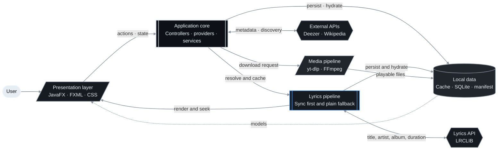

Long running work network calls, file scanning, image loading, media processing
and database operations is coordinated outside the JavaFX Application Thread
whenever possible. Controllers consume hydrated models from the cache or
SQLite, while services isolate I/O and external integrations. Request scopes,
render generations and coordinated database writes prevent stale responses,
race conditions and parallel operations from affecting the screen currently
visible to the user.
Lyrics follow the same pipeline: track metadata is used to resolve a song
through LRCLIB, synchronized lyrics are preferred, plain text is used as a
fallback, and the result is persisted for offline playback.


## Requirements

- Windows x64.
- JDK 21 available through `JAVA_HOME` or `PATH`.
- Internet access for Deezer, Wikipedia, discovery and remote previews.
- Inno Setup 6 only when creating the installer.

## Run from source

From the repository root:

```powershell
.\mvnw.cmd -DskipTests compile
.\mvnw.cmd clean javafx:run
```

The JavaFX entry point is:

```text
io.github.guillermodubon.musicplayer.MusicPlayer
```

## Windows packaging

Build a self-contained application image:

```powershell
.\packaging\build-app-image.ps1
```

Build the installer with Inno Setup 6:

```powershell
.\packaging\build-installer.ps1
```

Generated files are placed under `target\jpackage\`.
More packaging details are available in
[`packaging/README.md`](packaging/README.md).

## Local data

The library database and manifest are stored outside the installation folder:

```text
%LOCALAPPDATA%\MusicPlayer\data\UserDataBase.db
%LOCALAPPDATA%\MusicPlayer\data\manifest.json
```

The manifest keeps track of local files and their synchronization state, while
SQLite stores the structured library, playlists, metadata relationships and
playback-related information.

## Project layout

```text
musicPlayer/
├── packaging/                 # Windows packaging scripts and notices
├── src/main/java/
│   ├── controllers/            # Screens and JavaFX components
│   ├── managers/               # Playback and high-level actions
│   ├── models/                 # Domain models
│   ├── repository/             # SQLite schema and DAOs
│   ├── services/               # APIs, navigation, downloads and startup
│   └── utils/                  # Shared application utilities
├── src/main/resources/         # FXML, CSS, SVG icons and images
├── pom.xml                     # Maven configuration
├── mvnw / mvnw.cmd             # Maven Wrapper
└── README.md
```
## Statement

GHDMusic is a personal project created for learning and experimentation in
desktop application development, media processing, music-library design and Api consuming.
It is intended for educational and personal use only and is not developed or
distributed for commercial purposes.
